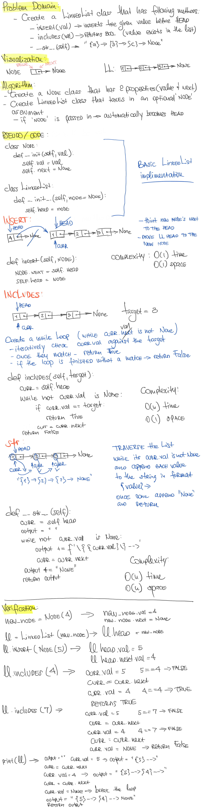
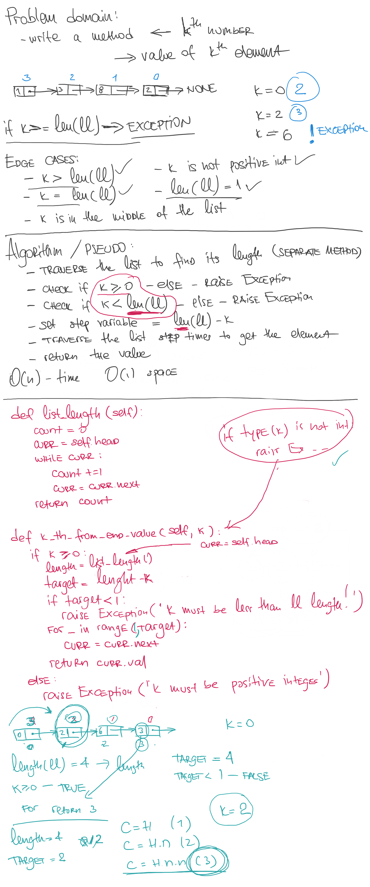

# Implementation: Singly Linked Lists

Linked List is a linear data structure.
It is a series of connected "nodes" that contains the "address" of the next node. Each node can store a data point which may be a number, a string or any other type of data.

## Author: _Leo Kukharau_

## Challenge

Create a Node classs and LinkedList class that will have a singly linked list properties including:

- prepend an element to the beginning of the linked list;
- check if the given element exists in the list;
- print all list elements as a string in a given format.

## Approach & Efficiency

- `insert()` can be described as O(1) time and O(1) space;
- `includes()` can be described as O(n) time and O(1) space;
- `__str__()` can be described as O(n) time and O(n) space.

## API

- `.insert()` - takes in any value as an argument prepends a new node with that value to the head of the list;
- `.includes()` - takes in any value as an argument and returns a boolean result depending on whether that value exists in the list;
- `.__str__()` - takes in no arguments and returns a string representing all the values in the Linked List

## Solution

# Linked List Insertions

## Author: _Leo Kukharau_ and _Thomas Sherer_

# Linked List k-th Value from the end

## Author: _Leo Kukharau_ and _Thomas Sherer_

<a href="./linked_list.py">Link to code</a>
